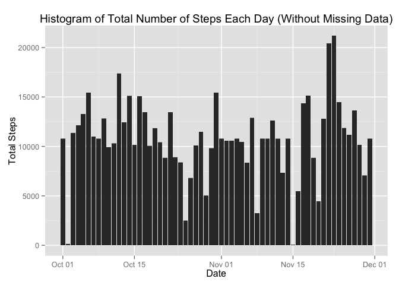

# Reproducible Research: Peer Assessment 1
### Settings

```r
echo=TRUE
```

### Loading and preprocessing the data

```r
library(ggplot2)
data <- read.csv(file = "activity.csv", header = TRUE, colClasses = c("integer","Date", "factor"))
completeData <- data[complete.cases(data),]
rownames(completeData) <- seq(length=nrow(completeData))
dim(completeData)
```

```
## [1] 15264     3
```

```r
head(completeData)
```

```
##   steps       date interval
## 1     0 2012-10-02        0
## 2     0 2012-10-02        5
## 3     0 2012-10-02       10
## 4     0 2012-10-02       15
## 5     0 2012-10-02       20
## 6     0 2012-10-02       25
```


### What is mean total number of steps taken per day?
- Make a histogram of the total number of steps taken each day:

```r
p <- ggplot(completeData, aes(date, steps))
p + geom_histogram(stat = "identity") + 
    labs(title = "Histogram of Total Number of Steps Each Day",
         x = "Date", 
         y = "Steps")
```

 

- Calculate and report the mean and median of the total number of steps taken per day
Mean Total Number of Steps:

```r
allSteps <- aggregate(completeData$steps, 
                      by = list(Date=completeData$date), 
                      FUN = "sum")
mean(allSteps$x)
```

```
## [1] 10766.19
```

- Median Total Number of Steps:

```r
median(allSteps$x)
```

```
## [1] 10765
```

### What is the average daily activity pattern?

- Make a time series plot of the 5-minute interval (x-axis) and the average number of steps taken, averaged across all days (y-axis):

```r
stepsPerInterval <- aggregate(data$steps, 
                              by = list(interval = as.numeric(as.character(data$interval))), 
                              FUN = "mean", 
                              na.rm = TRUE)

colnames(stepsPerInterval) <- c("interval", "steps")

m <- ggplot(stepsPerInterval, mapping=aes(interval,steps))
m + geom_line(color="#009E73", size=0.7) + 
    labs(title = "Time series plot", 
         x = "Interval (every 5-minutes)", 
         y = "Avg no of steps across all days")
```

 

- Which 5-minute interval, on average across all the days in the dataset, contains the maximum number of steps?:

```r
maxInterval <- stepsPerInterval[which.max(stepsPerInterval$steps),]
```
The **835th** interval has maximum steps of **206.17**


### Imputing missing values

- Total number of missing values in the dataset (NAs):

```r
sum(is.na(data$steps))
```

```
## [1] 2304
```
- Devise a strategy for filling in all of the missing values in the dataset. The strategy does not need to be sophisticated. For example, you could use the mean/median for that day, or the mean for that 5-minute interval, etc.
- Create a new dataset that is equal to the original dataset but with the missing data filled in.

Strategy for filling missing values is to first create a dataset containing the average steps per every 5-minute interval. Then followed by looping through the rows of the original dataset and using coinciding interval to fill the NAs column:

```r
avgSteps <- aggregate(completeData$steps, list(interval = completeData$interval), FUN = "mean")
colnames(avgSteps) <- c("interval", "meanStep")

fillData <- data
for(i in 1: nrow(fillData)){
    if(is.na(fillData$steps[i])){
        fillData$steps[i] <- avgSteps[which(fillData$interval[i] == avgSteps$interval), ]$meanStep
    }
}

head(fillData)
```

```
##       steps       date interval
## 1 1.7169811 2012-10-01        0
## 2 0.3396226 2012-10-01        5
## 3 0.1320755 2012-10-01       10
## 4 0.1509434 2012-10-01       15
## 5 0.0754717 2012-10-01       20
## 6 2.0943396 2012-10-01       25
```

New number of rows with NAs:

```r
sum(is.na(fillData$steps))
```

```
## [1] 0
```

- Make a histogram of the total number of steps taken each day and Calculate and report the mean and median total number of steps taken per day

```r
ggplot(fillData, aes(date, steps)) + 
    geom_histogram(stat = "identity") + labs(title = "Histogram of Total Number of Steps Each Day (Without Missing Data)",
         x = "Date", 
         y = "Total Steps")
```

 

- Do these values differ from the estimates from the first part of the assignment? What is the impact of imputing missing data on the estimates of the total daily number of steps?

Mean of Filled Data:

```r
filledSteps <- aggregate(fillData$steps, 
                      by = list(Date=fillData$date), 
                      FUN = "sum")
mean(filledSteps$x)
```

```
## [1] 10766.19
```

Median of Filled Data:

```r
median(filledSteps$x)
```

```
## [1] 10766.19
```

- Compared the differences of both sets of data

new mean - old mean:

```r
mean(filledSteps$x) - mean(allSteps$x)
```

```
## [1] 0
```

new median - old median:

```r
median(filledSteps$x) - median(allSteps$x)
```

```
## [1] 1.188679
```

After filling the missing values, the new median is greater than the old median. While the old mean and new mean stayed the same.


### Are there differences in activity patterns between weekdays and weekends?

1. Create a new factor variable in the dataset with two levels ??? ???weekday??? and ???weekend??? indicating whether a given date is a weekday or weekend day.


```r
fillData$week <- factor(format(fillData$date, "%A"))
levels(fillData$week)
```

```
## [1] "Friday"    "Monday"    "Saturday"  "Sunday"    "Thursday"  "Tuesday"  
## [7] "Wednesday"
```


```r
levels(fillData$week) <- list(weekday = c("Monday", "Tuesday", "Wednesday", "Thursday", "Friday"), 
         weekend = c("Saturday", "Sunday"))

table(fillData$week)
```

```
## 
## weekday weekend 
##   12960    4608
```
